# Use MetaMask For BAS

!!! Tip You may encounter a network configuration issue in recent releases of MetaMask. If so, please go to the "Upgrade" section for solution

## What is it?

MetaMask was created out of the needs for creating more secure and usable Ethereum-based web sites. In particular, it handles account management and connecting users to the blockchain. It’s supported in Chrome, Brave, and Safari browsers.

## Install

**Example: Install MetaMask in Brave browser**

* Open Extension Category in Brave: https://chrome.google.com/webstore/category/extensionsSearch for MetaMask

Note: Make sure it’s offered by metamask.io

* Click on “Add to Brave”

That’s it! You have successfully installed the MetaMask extension on Brave! 

Tip: The workflow is the same for all browsers

## Create an account in MetaMask for BAS

1. Click on the “Create a wallet” button

&#x20;

2\. Create Password of at least 8 characters\

3\. Click on “Create” and then write down your backup phrase.

4\. Select each phrase in order to make sure it is correct then click “Confirm”.

Congratulations! You have created your MetaMask account!

## Connect Your MetaMask With BAS

1. Go to the setting page\

2\. Add a new network\
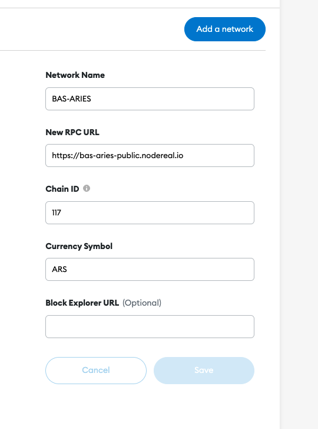\

* Aries Testnet
  * RPC URL:  [https://bas-aries-public.nodereal.io](https://bas-aries-public.nodereal.io)
  * ChainID: 0x75, 117 in decimal (if 117 doesn’t work, try 0x75)
  * Symbol: ARS

3\. Claim some testnet token to your account then click on your address to copy

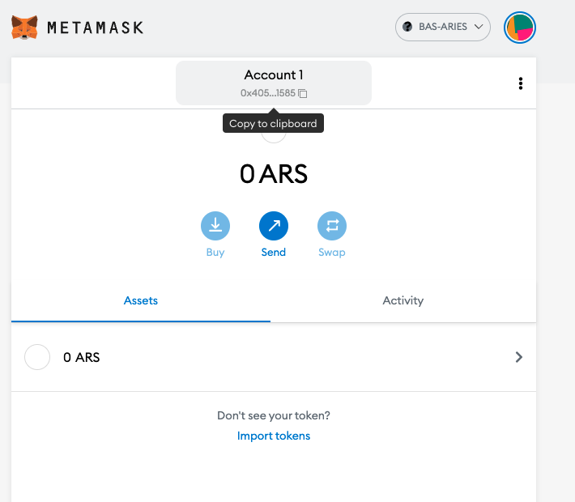

4\. Go to faucet page: [https://bas-aries-faucet.nodereal.io/](https://bas-aries-faucet.nodereal.io/), then paste your address in the box and click on “Give me ARS”

!!! Tip: Please note that you can only claim once every minute \
After the transfer transaction is sent, you will see an increase in your balance

## Transfer ARS to other BAS address

1.  Log in to your MetaMask\

    
2. Click on "Send" button\
   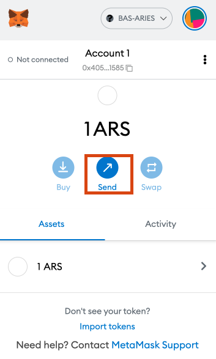
3.  Copy the receiver’s address in the box\

    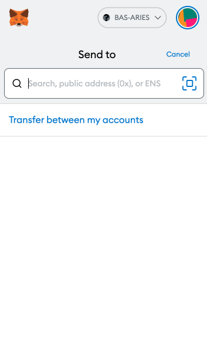
4. Input the amount\
   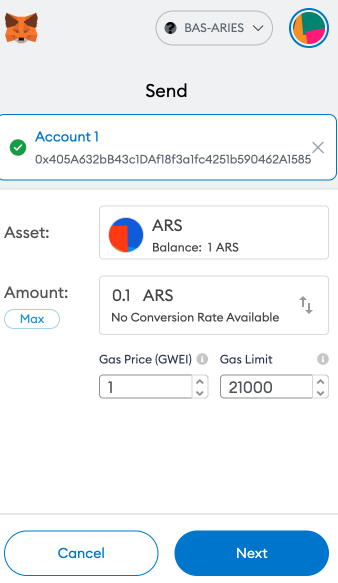
5. Confirm your transaction, then click Next
6.  Click Confirm to send your transaction\

    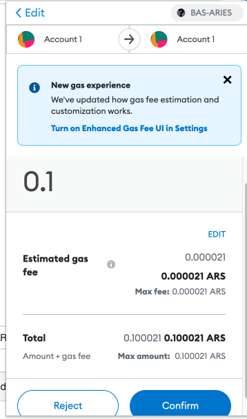
7.  Wait for your transaction to be included in the new block\

    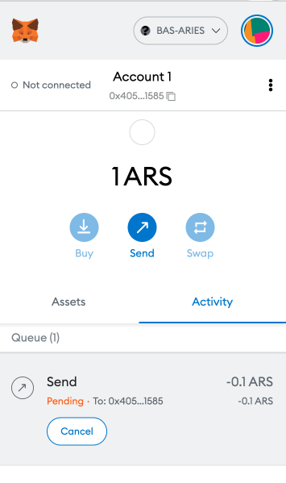
8. Once your transaction is confirmed, check it on block explorer by clicking Details\

9. Click on your account to see "Details''\
   &#x20;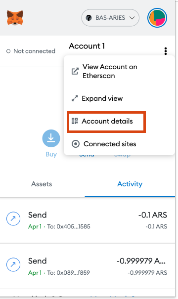

## Add BEP20 Tokens

1.  In MetaMask, Click on “Import tokens”\

    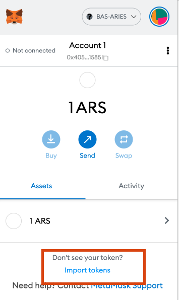
2.  Copy the token contract address in the box

    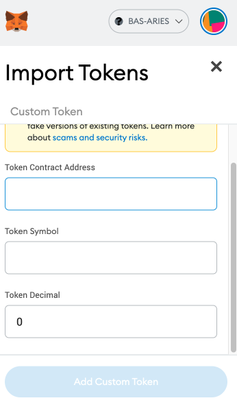
3. Click on “Add Custom Token”\
   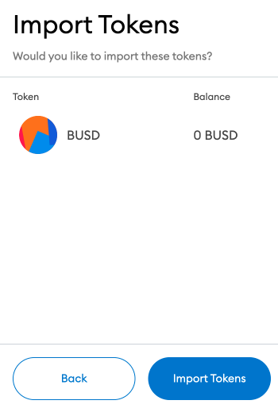
4. Click on "Import Tokens"
5. BEP20 token added

## Create Multiple Accounts

1.  To create multiple accounts, click on Profile icon on MetaMask and then click on Create Account\

    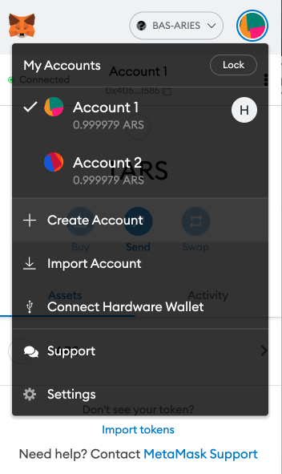
2.  You can then add an account name and click on Create.\

    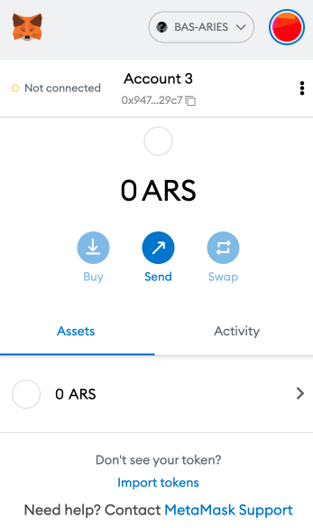
3.  Then you can see a new account has been created!\

