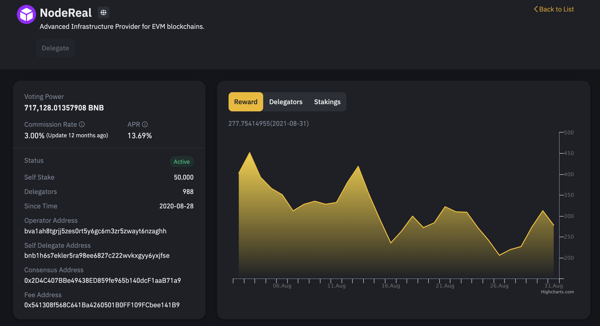

# Staking Guide & Instructions

The easiest way to stake BNB is via [Binance Extension Wallet](https://www.binance.org/en/binance-wallet).

1. Head to [https://www.binance.org/en/staking](https://www.binance.org/en/staking) and unlock  [Binance Extension Wallet](https://www.binance.org/en/binance-wallet).
2. Find [NodeReal](https://www.binance.org/en/staking/validator/bva1ah8tgrjj5zes0rt5y6gc6m3zr5zwayt6nzaghh) in the validator list.
3. Click the “Delegate” button.
4. Enter the amount you want to delegate. Remember to keep some BNB available to pay for transaction fees.
5. Then click “Confirm” to approve the transaction.

NodeReal's Validator Address: _**0x2D4C407BBe49438ED859fe965b140dcF1aaB71a9**_&#x20;

Need more detailed instructions? [See full guide](https://binance-wallet.gitbook.io/binance-chain-extension-wallet/binance-chain-staking/staking)
